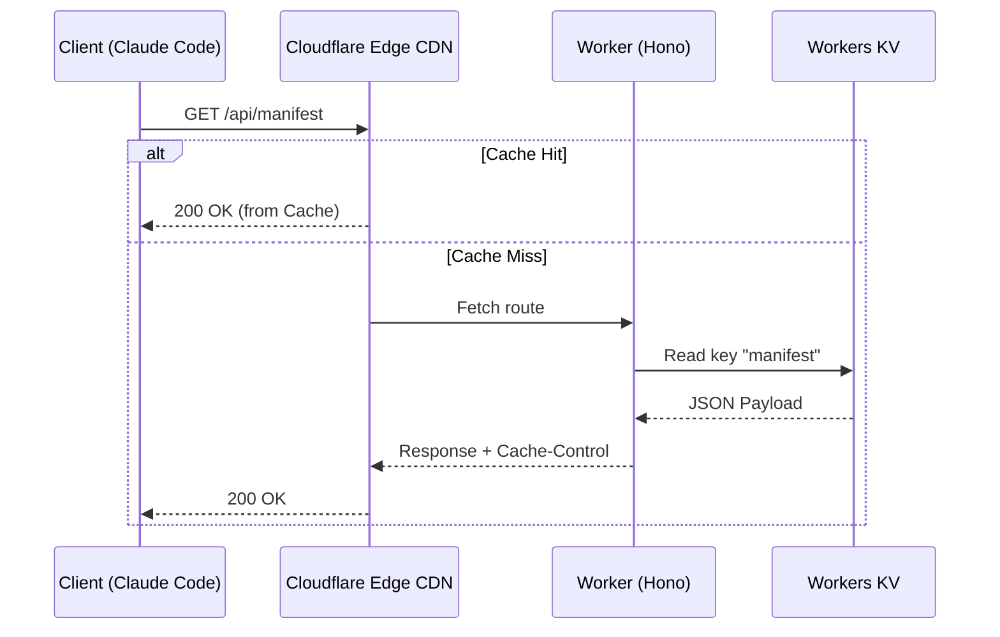

# Design Document: Remote Marketplace Server (market.chitty.cc)

**Status:** APPROVED (Resuming from Brainstorming Session)  
**Author:** Antigravity  
**Target Architecture:** Cloudflare Workers (Hono) + Workers KV  

---

## 1. Routing & API Endpoints

The worker executes at the custom domain `market.chitty.cc/*`.

| Endpoint | Method | Response Type | Description |
|---|---|---|---|
| `/health` | `GET` | `application/json` | Health status and catalog counts |
| `/api/manifest` | `GET` | `application/json` | Native Claude Code manifest (`marketplace.json`) |
| `/api/plugins` | `GET` | `application/json` | Full plugin list (supports `?category=` and `?type=`) |
| `/api/profiles` | `GET` | `application/json` | List of installation profiles (e.g. `devops`, `legal`) |
| `/api/profiles/:name`| `GET` | `application/json` | Capability IDs belonging to a specific profile |

### Endpoint Schemas

#### `GET /health`
```json
{
  "status": "ok",
  "service": "chittymarket",
  "version": "2.0.0",
  "plugins_count": 12,
  "capabilities_count": 104
}
```

#### `GET /api/profiles`
```json
{
  "profiles": ["minimal", "coding", "devops", "legal", "integrations", "full"]
}
```

---

## 2. KV Store Schema & Caching Layer

To guarantee sub-10ms response times at the edge, all dynamic resolution queries are backed by **Cloudflare Workers KV** (`MARKET_CATALOG` namespace).

### Key Bindings

| KV Key | Value Schema | Description |
|---|---|---|
| `manifest` | JSON string | Raw `.claude-plugin/marketplace.json` |
| `profiles` | JSON string | Catalog profiles mapping |
| `plugins:<name>` | JSON string | Specific plugin's `plugin.json` manifest |
| `telemetry:agg` | JSON string | Aggregated, opt-in download stats (future) |

### Caching Strategy



*   All endpoints will return a `Cache-Control: public, max-age=3600` header (1-hour edge caching).
*   Updates are forced to bypass cache during sync deployment by incrementing a version query-string or flushing the edge cache.

---

## 3. GitHub Actions Sync Pipeline

To prevent local manifest drift, changes to the `CHITTYOS/chittymarket` repository will auto-sync to the KV namespace via GitHub Actions.

### Workflow Trigger
On pushes to `main` that modify `plugins/`, `marketplace.json`, or `profiles.json`.

### Steps:
1.  **Hygiene & Lints**:
    *   Runs `scripts/lint-plugins.sh` to assert manifest matches directories.
    *   Runs `scripts/test-plugins.sh` to verify frontmatter compliance.
2.  **Manifest Generation**:
    *   Generates `.claude-plugin/marketplace.json` via `scripts/generate-marketplace.sh`.
3.  **Wrangler KV Sync**:
    *   Pushes the updated manifests to KV keys:
        ```bash
        npx wrangler kv:key put --binding=MARKET_CATALOG "manifest" --file=./.claude-plugin/marketplace.json
        npx wrangler kv:key put --binding=MARKET_CATALOG "profiles" --file=./profiles.json
        ```

---

## 4. Client Bootstrapping Integration

### Standalone Profile Installer
When bootstrapping a developer workspace, profiles are resolved remotely:

```bash
# Install a profile (e.g. devops)
curl -s "https://market.chitty.cc/api/profiles/devops" | \
  jq -r '.plugins[]' | \
  xargs -I {} claude plugin install {}@chittymarket
```
