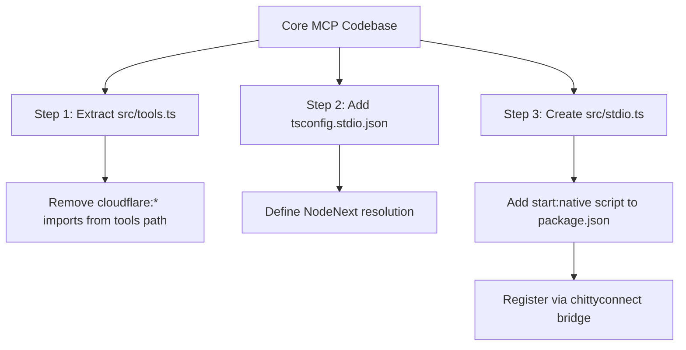

# Comprehensive MCP Gap Analysis Report
**Document ID**: `REP-MCP-GAP-2026-06-13`  
**Status**: DRAFT  
**Subject**: Review of all currently built Model Context Protocol (MCP) servers in the ChittyOS ecosystem.  
**Auditor**: Antigravity (Advanced Agentic Coding)  

---

## Executive Summary

The ChittyOS ecosystem hosts a large number of micro-agents and services implemented as Cloudflare Workers. While these workers are highly optimized for deployment to Cloudflare Edge using wrangler and `miniflare`/`workerd`, there is a significant operational misalignment between **Edge Deployability** and **Local Developer Agent Usability**. 

Most MCP servers in the codebase cannot be run natively over `stdio` without spawning a full `wrangler dev` loop. Furthermore, they suffer from dependency pollution (import drift) that throws fatal ESM resolution errors in Node.js environments.

This report catalogs these structural issues and outlines a path to align the codebase with local, stdio-based execution paradigms.

---

## Current Catalog of MCP Servers

The following workers instantiate `new McpServer` or extend `McpAgent` to serve tools:

| Service Name | Primary Function | Stdio Entrypoint? |
| --- | --- | --- |
| `chittyagent-helper` | Ecosystem navigation & directional search | **Yes** (`src/stdio.ts`) |
| `chittyagent-autoassist` | Reusable loop templates & task dispatch | **Yes** (`src/stdio.ts`) |
| `chittyagent-mcp-builder` | Scaffold, validate & sync MCP servers | **Yes** (`src/stdio.ts`) |
| `chittyagent-tasks` | Core agent task queue management | No |
| `chittyagent-notes` | RAG search over Apple Notes | No |
| `chittyagent-finance` | Mercury & Neon ledger integrations | No |
| `chittyagent-evidence` | Legal evidence ingestion & tracking | No |
| `chittyagent-canon` | System-wide policy & document registry | No |
| `chittyagent-turbotenant` | Property management portal sync | No |
| `chittyagent-cloudflare` | Cloudflare Workers & DNS operations | No |
| `chittyagent-scrape` | Apify-backed portal scraping | No |
| `chittyagent-auth` | JWT issuance & verification | No |
| `chittyagent-bluebubbles` | iMessage bridge | No |
| `chittyagent-twilio` | SMS messaging | No |
| `chittyagent-chatgpt` | ChatGPT custom actions bridge | No |
| `chittyagent-dispute` | Disputes and claims tracking | No |
| `chittyagent-dispatch` | Remote task dispatching | No |
| `chittyagent-viewport` | UI viewport tracking | No |
| `chittyagent-cleaner` | local macOS/Linux cache cleanup | No |

---

## Key Gaps & Inconsistencies

### 1. The Stdio Wrapper Gap
* **Finding**: Only **3 out of 39+ workers** currently possess a native `stdio.ts` entrypoint.
* **Impact**: Developer agents running locally (like Claude Desktop, Codex, or local terminal runners) cannot launch these servers directly in their `mcp_config.json` via standard Node execution. They must run them via HTTP/SSE proxies, which requires running `wrangler dev` for every single dependency, eating CPU/RAM and requiring environment variables to be populated in multiple wrangler contexts.
* **Opportunity**: Standardize a `src/stdio.ts` template and a `"start:native"` script in `package.json` for all core workers.

### 2. Import Pollution & Cloudflare Protocol Drift
* **Finding**: Workers import `McpAgent` from `agents/mcp` or import type configurations from `@cloudflare/workers-types` directly in `src/index.ts`. Because `agents/mcp` depends on `cloudflare:email` and `cloudflare:workers` protocols, attempting to run these files in Node.js throws `ERR_UNSUPPORTED_ESM_URL_SCHEME`.
* **Impact**: Node.js crashes on startup due to un-resolvable Cloudflare-specific imports.
* **Correction**: Establish a strict **Tools Decoupling Pattern**. The Hono edge routing and Durable Object classes (like `NotesAgent` or `HelperAgent`) must stay inside `src/index.ts`. All tool definitions, schemas, and processing logic must reside in `src/tools.ts`. The `stdio.ts` entrypoint then imports strictly from `tools.ts`, leaving Cloudflare dependencies completely un-evaluated in Node.js.

### 3. Duplicate D1/KV Shimming
* **Finding**: In `chittyagent-helper/src/stdio.ts`, a custom `D1Shim` using `node:sqlite` and a custom `FileKV` using FS json files are implemented to mock the database bindings.
* **Impact**: As more stdio wrappers are added, this shimming code is copied and pasted, leading to maintenance debt and logic drift.
* **Correction**: Extract `D1Shim` and `FileKV` (or similar mock bindings) into `workers/shared` as reusable utilities.

### 4. Package Configuration Inconsistencies
* **Finding**: Some package configurations (e.g., `chittyagent-notes`) lack `"type": "module"`.
* **Impact**: Breaks Node's default ESM resolution, leading to import errors or requiring file extension hacks.
* **Correction**: Ensure all package configurations explicitly include `"type": "module"` and standardize the build pipelines.

---

## Action Plan: Opportunities for Improvement

### Phase 1: Establish the Tools Decoupling Pattern
For every active worker:
1. Move all tools registration (e.g., `server.tool(...)`) and processing imports into a dedicated `src/tools.ts` file.
2. In `src/index.ts`, import the registration function from `tools.js` to define tools for the Edge Durable Object.
3. Keep `src/index.ts` strictly as the Edge worker endpoint.

### Phase 2: Add Stdio Harnesses
1. Add `tsconfig.stdio.json` referencing `NodeNext` ESM module resolution.
2. Create `src/stdio.ts` referencing `src/tools.ts` and shimming any needed D1/KV namespaces using shared wrappers.
3. Configure `package.json` with:
   - `"build:native": "tsc -p tsconfig.stdio.json"`
   - `"start:native": "node dist/stdio.js"`

### Phase 3: Gateway Integration (ChittyConnect)
1. Do not hardcode authentication tokens or credentials in `mcp_config.json` configuration blocks.
2. Use the central `chittyconnect` token broker and base URLs so that `mcp-remote` can dynamically negotiate access client credentials.

---

*Document Category: Governance Audit Finding / Architectural Guidelines*  
*Canonical Reference: chittycanon://docs/ops/policy/audit-mcp-gap-2026-06-13*  
